<h2 align="center">Hey, everyone! 👋 I'm Rodolfo</h2>

<h3 align="center">A Full Stack Developer </h3>

Programming Language

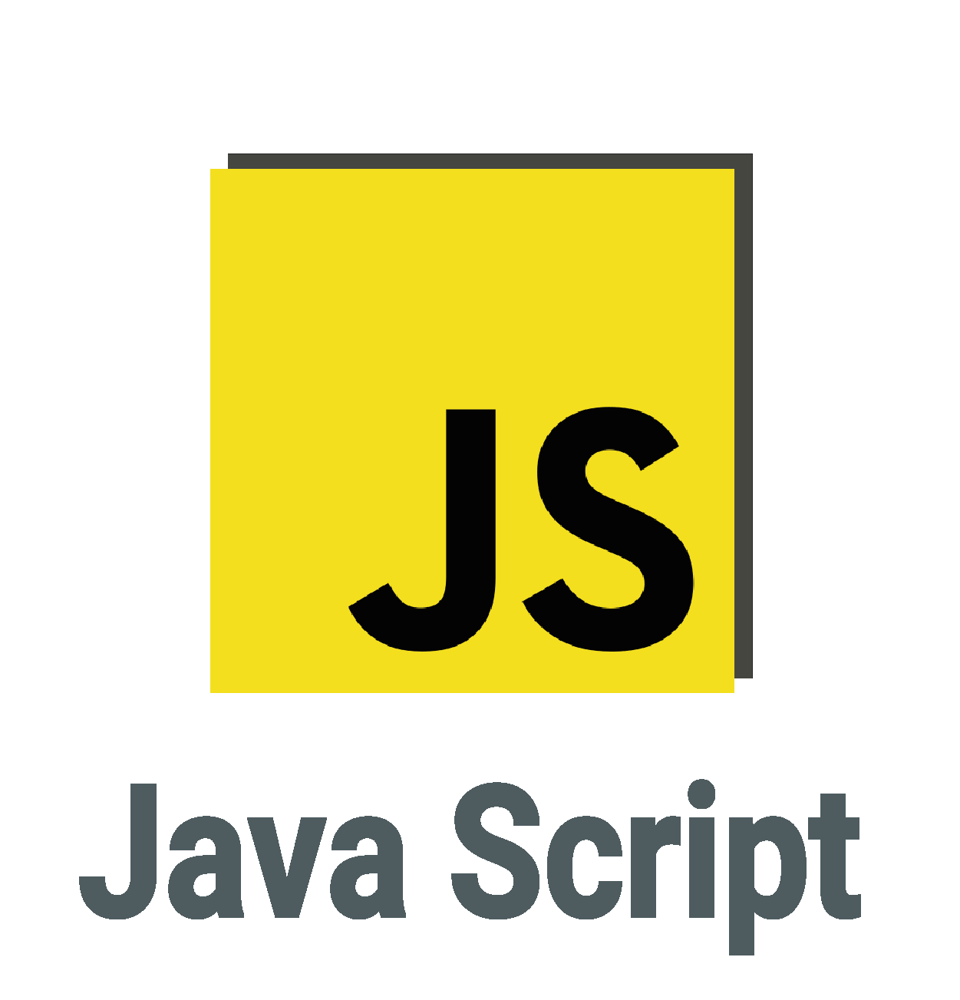

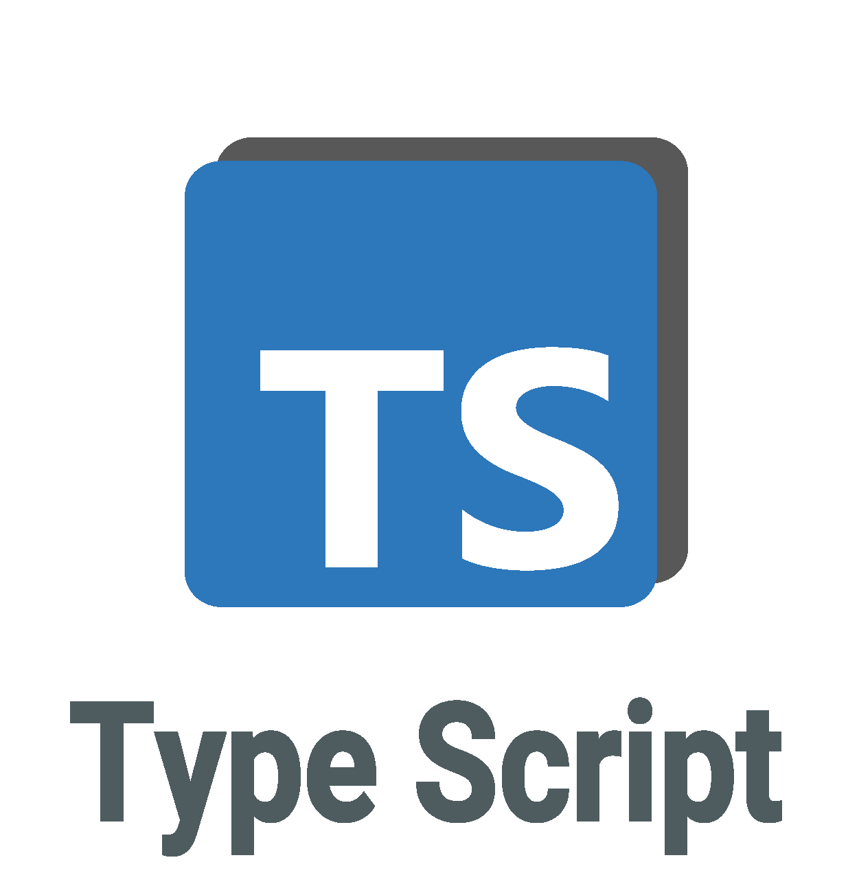

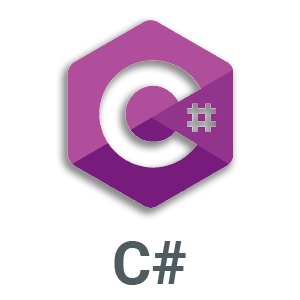

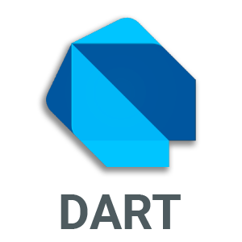

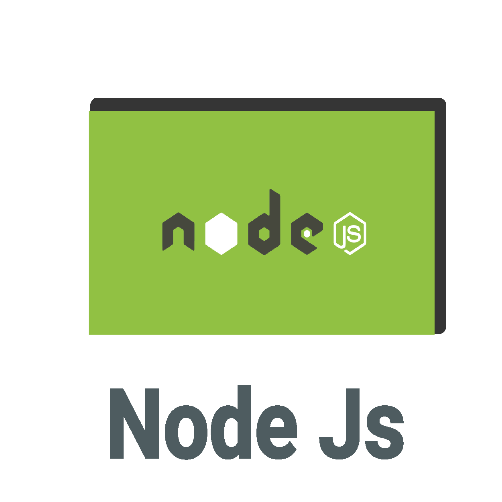

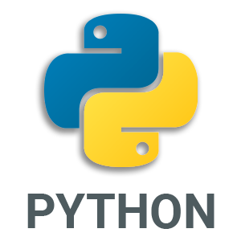

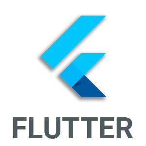

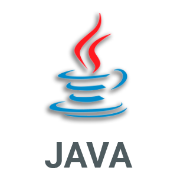

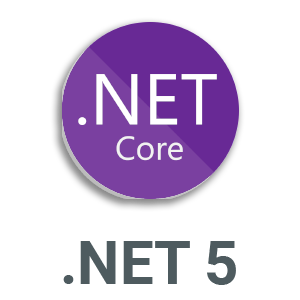

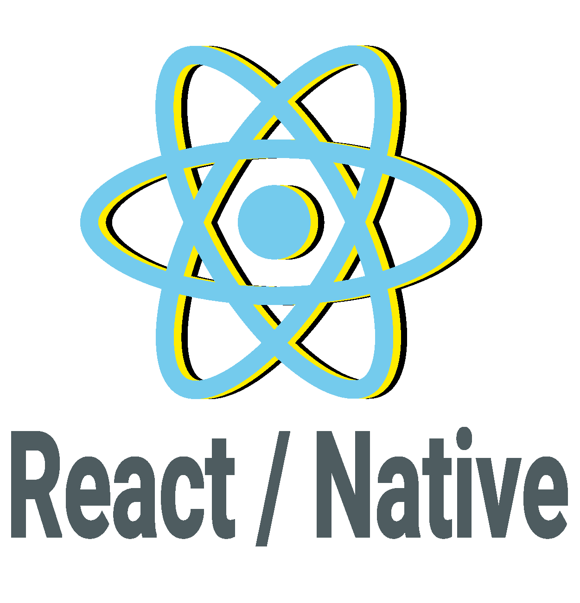

Interface's

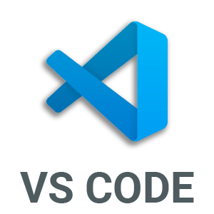

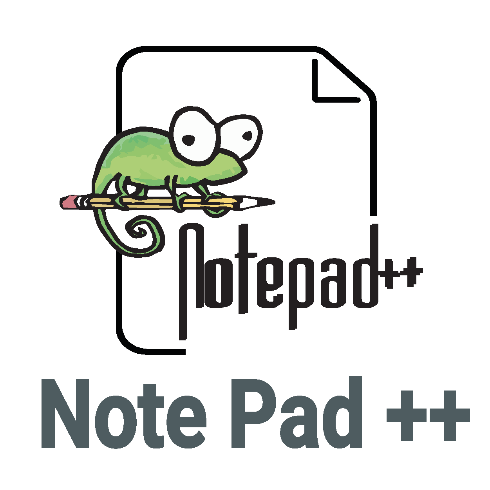

#### I'm organizing for here !!

#### Currently studying:

- Full Stack Development
  - React Native
  - C#
  - Node.js
  - HTML
  - CSS
  - Java
  - Javascript
  - Typescript
  - Flutter
  - Python
- Machine Learning
- Api Rest
- Web Developer
- Front-End
- Back-End (especialist)
- Deep Learning
- Languages
  - English
  - Portugues
  - Español

#### Plans for the year:

- [x] Get knowledge
- [x] Create a great portfolio
- [x] Have fun working on personal projects
- [ ] Get a new job with coder

#### Contact Info

