<!-- ============================================
     🎮 FRANCOS CORPORATION - PORTFÓLIO GAMIFICADO
     ============================================ -->

<div align="center">

# 👨‍💻 Hey, everyone! 😎 I'm Rodolfo

### 🚀 Full Stack Developer | System Architect | Tech Enthusiast

</div>

<!-- ============================================
         📊 GITHUB README STATS (INTEGRADO)
     ============================================ -->

<div align="center">


</div>

<!-- ============================================
         📡 SISTEMA DE NAVEGAÇÃO INTERATIVO
     ============================================ -->

<div align="center">

---

## 🧭 MENU PRINCIPAL - SELECIONE UMA MISSÃO

| 🎯 **Sobre Mim** | 💼 **Projetos** | 🛠️ **Stack** | 📈 **Stats** | 🔗 **Contato** |
|:----------------:|:---------------:|:------------:|:-----------:|:--------------:|
| [`👤 Sobre`](#-sobre-mim) | [`🔧 Projetos`](#-projetos) | [`💻 Tecnologias`](#-tecnologias) | [`📊 Métricas`](#-métricas-vivas) | [`📬 Contato`](#-contato-rápido) |

---

</div>

<!-- ============================================
          🎯 SOBRE MIM - STATUS DO JOGADOR
     ============================================ -->

<div align="center">

## 🎯 Sobre Mim

### ⚡ Status Atual: `ONLINE` ✅

```
╔══════════════════════════════════════════════════════════╗
║  NÍVEL:      Full Stack Developer                        ║
║  ESPECIALIDADE: Back-End (Expert)                        ║
║  OBJETIVO:    Criar soluções escaláveis e inovadoras     ║
╚══════════════════════════════════════════════════════════╝
```

### 🎓 Áreas de Conhecimento

| Área | Status | Nível |
|------|--------|-------|
| Full Stack Development | 🟢 Ativo | Expert |
| Machine Learning | 🟡 Em Estudo | Intermediate |
| API Rest | 🟢 Ativo | Advanced |
| Web Developer | 🟢 Ativo | Expert |
| Front-End | 🟢 Ativo | Advanced |
| Back-End (Especialista) | 🟢 Ativo | Master |
| Deep Learning | 🔴 Futuro | Beginner |

### 🌍 Idiomas

| Idioma | Nível |
|--------|-------|
| English | 🟡 Intermediate |
| Português | 🟢 Native |
| Español | 🟡 Basic |

</div>

<!-- ============================================
         💻 TECNOLOGIAS - ARSENAL DO JOGADOR
     ============================================ -->

<div align="center">

## 💻 Tecnologias

### 🎨 Linguagens de Programação

```bash
# Core Languages
$ export LANGUAGES="JavaScript, TypeScript, C#, Dart, Python"

# Backend Frameworks
$ export BACKEND="Node.js, Java, .NET 5"

# Mobile & Frontend
$ export FRONTEND="React, Flutter"
```

<div align="center">

| 🟦 JavaScript | 🟩 TypeScript | 🔴 C# | 🔵 Dart |
|:------------:|:-------------:|:-----:|:-------:|
| 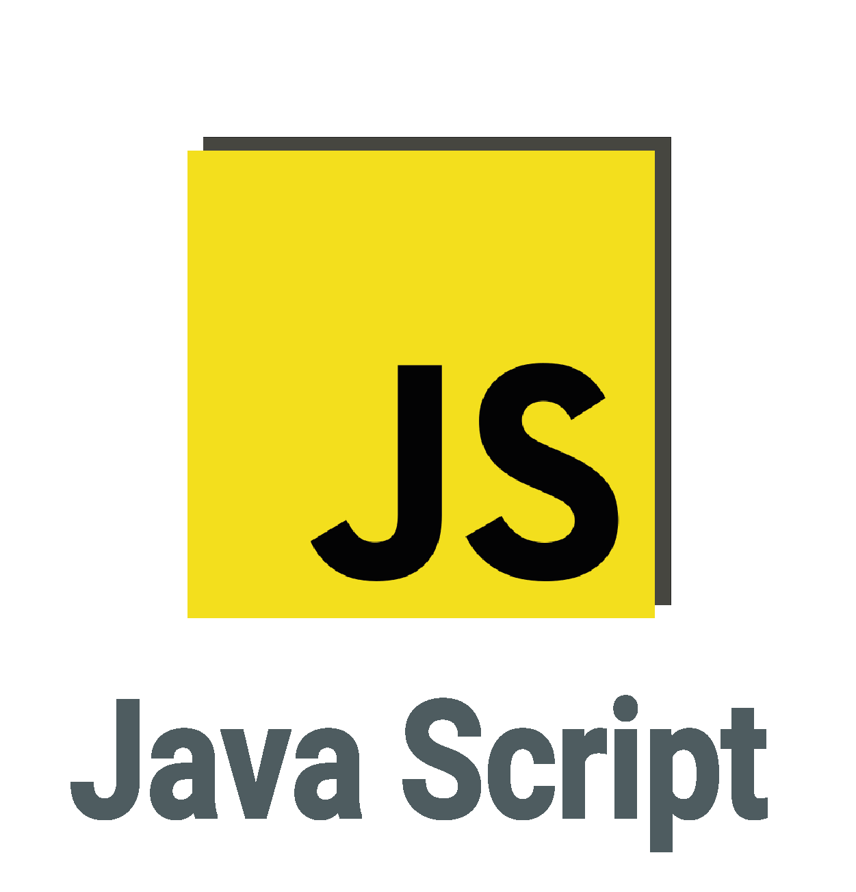 | 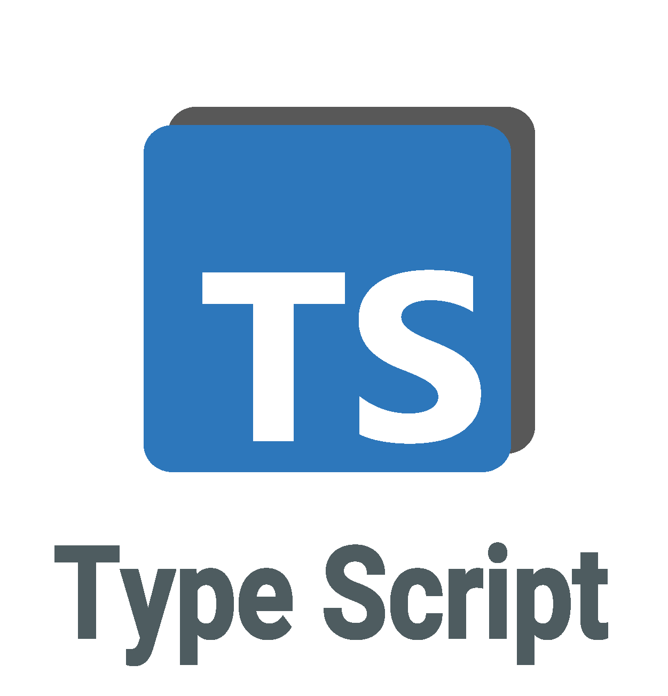 | 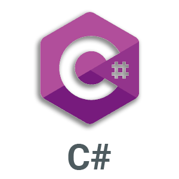 | 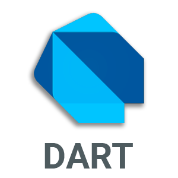 |

</div>

<div align="center">

| 🟩 Node.js | 🐍 Python | 🎨 Flutter | ☕ Java |
|:----------:|:---------:|:----------:|:------:|
| 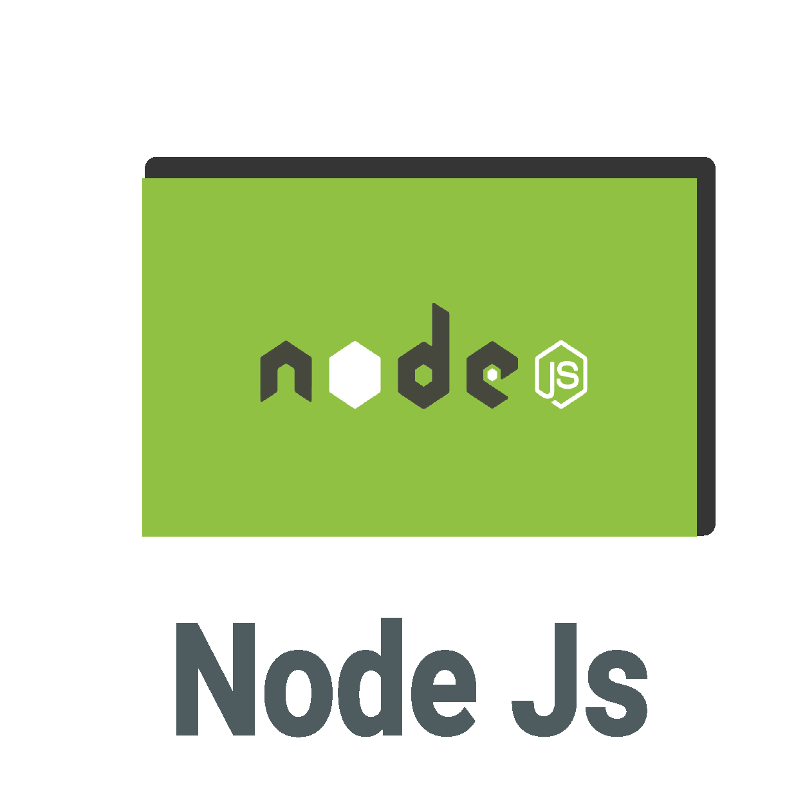 | 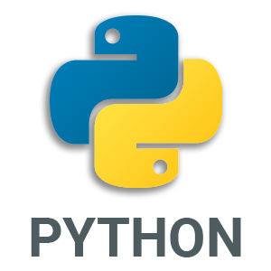 | 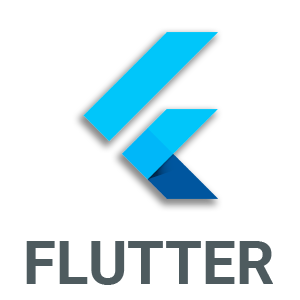 | 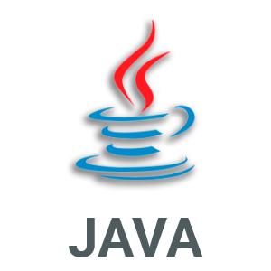 |

</div>

<div align="center">

| 🌐 .NET 5 | ⚛️ React | 💻 VSCode | 📝 Notepad++ |
|:---------:|:--------:|:---------:|:------------:|
| 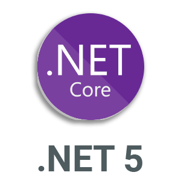 | 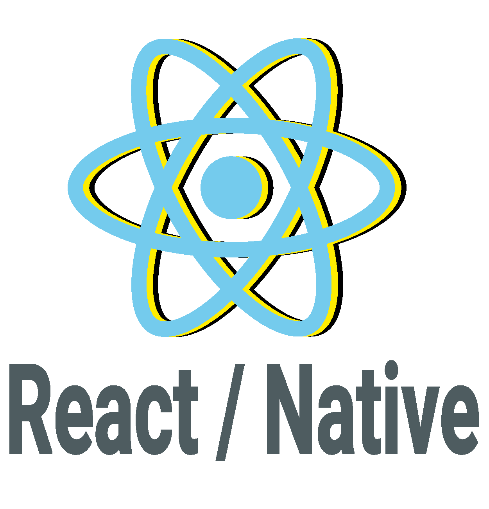 | 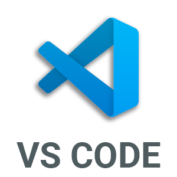 | 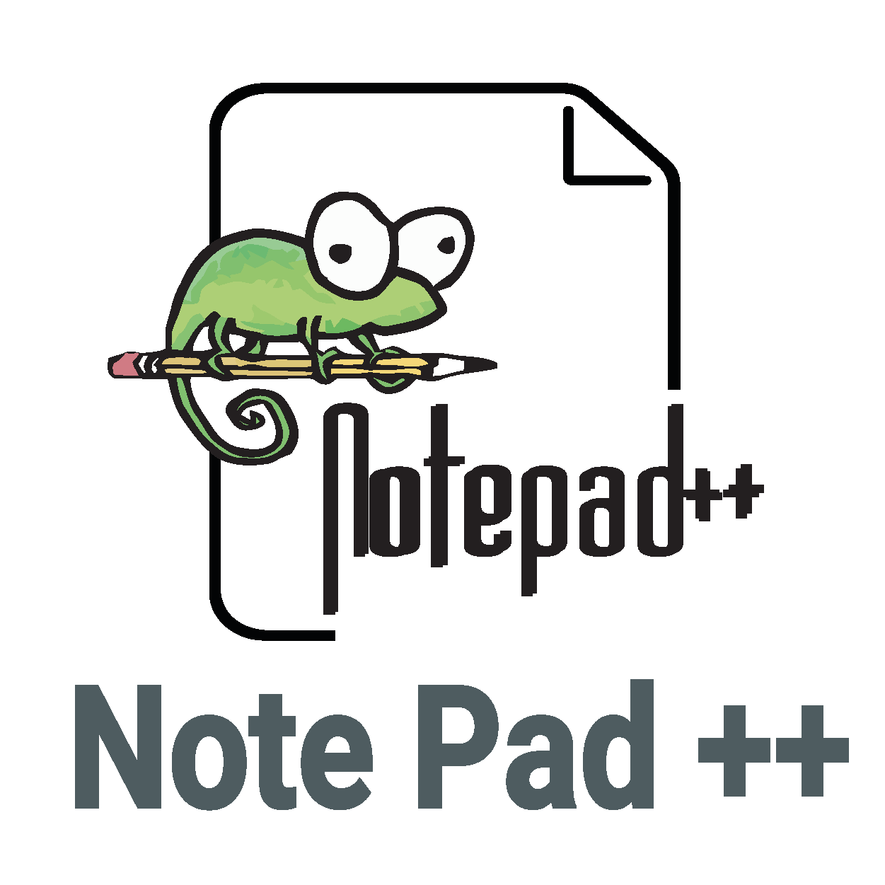 |

</div>

### 📦 Stack Completo

```
┌─────────────────────────────────────────────────────────────┐
│  FRONTEND           │  BACKEND          │  MOBILE           │
│  ───────────────────┼───────────────────┼───────────────────┤
│  React              │  Node.js          │  Flutter          │
│  TypeScript         │  Java             │                   │
│  JavaScript         │  .NET 5           │                   │
│                      │  Python          │                   │
│                      │  C#               │                   │
└─────────────────────────────────────────────────────────────┘
```

</div>

<!-- ============================================
        🔧 PROJETOS - MISSÕES COMPLETADAS
     ============================================ -->

<div align="center">

## 🔧 Projetos

### 📂 Navegador de Projetos

| Projeto | Status | Linguagens | Complexidade |
|---------|--------|------------|--------------|
| [`🤖 Padrão.ai`](Icons/Projects/padrão.ai) | 🟢 Ativo | AI/ML | ⭐⭐⭐⭐⭐ |
| ... | ... | ... | ... |

### ➕ Adicionar Novo Projeto

```bash
# Template para novos projetos:
# 1. Crie pasta em Icons/Projects/
# 2. Adicione ícone representativo
# 3. Atualize tabela acima com:
#    - Nome do projeto
#    - Link (href)
#    - Status (🟢 Ativo | 🟡 Em Desenvolvimento | 🔴 Abandonado)
```

</div>

<!-- ============================================
       📊 MÉTRICAS VIVAS - DASHBOARD DE PERFORMANCE
     ============================================ -->

<div align="center">

## 📊 Métricas Vivas

### 🎯 Objetivos Anuais

| Objetivo | Status | Progresso |
|----------|--------|-----------|
| Get knowledge | ✅ Concluído | 100% |
| Create a great portfolio | ✅ Concluído | 100% |
| Have fun working on personal projects | ✅ Concluído | 100% |
| Get a new job with coder | ⏳ Em Progresso | 75% |

```
╔══════════════════════════════════════════════════════════╗
║  🎯 ANO: 2026                                            ║
║  📈 PROGRESSO GERAL: ████████████░░░░ 80%               ║
║  ⏳ PRÓXIMO OBJETIVO: Get a new job with coder           ║
╚══════════════════════════════════════════════════════════╝
```

### 📈 Métricas do Repositório

| Métrica | Valor | Status |
|---------|-------|--------|
| ⭐ Stars | **Ver no GitHub** | Atualizado semanalmente |
| 🔀 Forks | **Ver no GitHub** | Atualizado semanalmente |
| 👁️ Watchers | **Ver no GitHub** | Atualizado semanalmente |
| 📝 Commits (30d) | **Ver no GitHub** | Atualizado diariamente |

### 🔄 Atualização Automática

Este README é alimentado por:

- ✅ GitHub Actions (workflow de atualização)
- ✅ github-readme-stats (stats visuais)
- ✅ Scripts personalizados de automação

</div>

<!-- ============================================
         📬 CONTATO RÁPIDO - CANAIS DE COMUNICAÇÃO
     ============================================ -->

<div align="center">

## 📬 Contato Rápido

### 🔗 Links Diretos

```bash
# Email
$ mailto:rodolfofranco14@hotmail.com

# WhatsApp
$ whatsapp://send?phone=5562985835588

# LinkedIn
$ https://www.linkedin.com/in/rodolfo-franco-26225549/
```

<div align="center">

| 📧 Email | 💬 WhatsApp | 🔗 LinkedIn |
|:--------:|:-----------:|:-----------:|
| <a href="mailto:rodolfofranco14@hotmail.com"></a> | <a href="https://api.whatsapp.com/send?phone=5562985835588"></a> | <a href="https://www.linkedin.com/in/rodolfo-franco-26225549/"></a> |

</div>

### 📱 QR Codes (Opcional)

```
┌─────────────────────────────────────────┐
│  Escaneie para conectar:                 │
│                                         │
│  [📧 Email]    [💬 WhatsApp]            │
│                                         │
└─────────────────────────────────────────┘
```

</div>

<!-- ============================================
         🛠️ COMO CONTRIBUIR - COLABORADORES
     ============================================ -->

<div align="center">

## 🛠️ Como Contribuir

### 📝 Contribuições Bem-vindas!

| Tipo | Descrição | Status |
|------|-----------|--------|
| 🐛 Bug Reports | Reportar problemas encontrados | Aberto |
| 💡 Feature Requests | Sugerir novas funcionalidades | Aberto |
| 🔧 Pull Requests | Enviar melhorias de código | Bem-vindo |
| 📚 Documentation | Melhorar a documentação | Bem-vindo |

### ⭐ Suporte ao Projeto

Se este projeto te ajudou, considere:

- ⭐ **Star** este repositório
- 💬 **Discussão** - Participe das discussões
- 🔗 **Share** - Compartilhe com colegas

</div>

<!-- ============================================
          📜 LICENÇA E RODAPÉ
     ============================================ -->

<div align="center">

## 📜 Licença

```
MIT License

Copyright (c) 2026 Rodolfo Franco

Permission is hereby granted, free of charge, to any person obtaining a copy
of this software and associated documentation files (the "Software"), to deal
in the Software without restriction, including without limitation the rights
to use, copy, modify, merge, publish, distribute, sublicense, and/or sell
copies of the Software.
```

---

<div align="center">

### 🎮 FRANCOS CORPORATION © 2026

> *"Code is poetry. Commit to excellence."*

</div>

<!-- ============================================
         🔧 CONFIGURAÇÕES DE AUTOMAÇÃO
     ============================================ -->

<div align="center" style="opacity: 0.7; font-size: 12px;">

### ⚙️ Este README é alimentado por:

- GitHub Actions (workflow de atualização)
- github-readme-stats (opcional)
- Scripts personalizados de automação

**Workflows disponíveis:**
- [`update-readme.yml`](.github/workflows/update-readme.yml) - Atualiza métricas e commits
- [`readme-stats.yml`](.github/workflows/readme-stats.yml) - Gera stats visuais

**Documentação adicional:**
- [`.github/README-STATS.md`](.github/README-STATS.md) - Integração de stats detalhada
- [`.github/CONTRIBUTING.md`](.github/CONTRIBUTING.md) - Guia de contribuição
- [`.github/USO-README.md`](.github/USO-README.md) - Guia completo de uso

</div>
